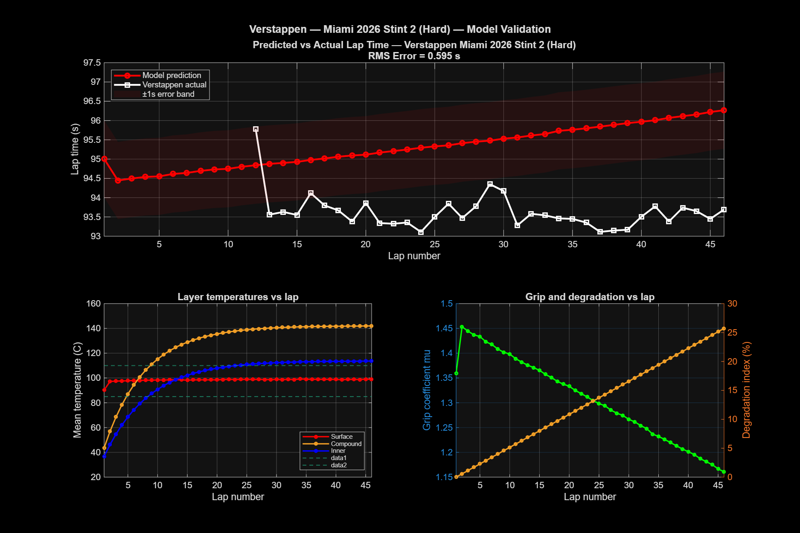

# F1 Tire Degradation Model 🏎️

A physics-based tire degradation model for Formula 1, built in MATLAB using real telemetry data. Validated against two drivers across two different circuits and compounds in the **2026 F1 season**.

---

## Validations

| Driver | Race | Compound | Stint | Laps | RMS Error |
|---|---|---|---|---|---|
| George Russell | Japanese GP — Suzuka | Medium | Stint 1 | 21 | 2.441 s |
| Max Verstappen | Miami GP | Hard | Stint 2 | 46 | **0.595 s** |

The Verstappen/Miami validation is particularly strong — **0.595s RMS over 46 laps** on a Hard compound demonstrates the model generalises well across drivers, circuits, and tire compounds.

---

## Overview

Tire degradation is one of the most critical and complex factors in F1 race strategy. This project models the physics of tire behaviour from first principles — heat generation, thermal diffusion, and grip loss — and validates the output against real telemetry data from FastF1.

The model is built around three layers of physics:
- **Friction heat generation** at the contact patch
- **Three-layer thermal ODE** tracking surface, compound, and inner liner temperatures
- **Viscoelastic grip model** with asymmetric bell curve and lap-by-lap wear

---

## Physics

### Heat Input Q(t)

Friction power at the contact patch is computed from the real speed trace and estimated lateral/longitudinal acceleration:

$$Q(t) = \mu \, F_N \, v_{slip}(t)$$

This becomes the forcing function driving the thermal ODE.

### Three-Layer Thermal ODE

Energy balance equations are solved with `ode45` across three tire layers:

**Surface layer:**
$$m_s c_p \frac{dT_s}{dt} = Q(t) - k_{sc}(T_s - T_c) - h_{conv} A_s (T_s - T_{air})$$

**Compound layer:**
$$m_c c_p \frac{dT_c}{dt} = k_{sc}(T_s - T_c) - k_{ci}(T_c - T_i)$$

**Inner liner:**
$$m_i c_p \frac{dT_i}{dt} = k_{ci}(T_c - T_i) - h_{inner} A_i (T_i - T_{cavity})$$

Each layer exchanges heat via conduction (Fourier's law) and convection (Newton's law of cooling). The surface layer has the lowest thermal mass and responds fastest; the compound layer acts as a thermal reservoir controlling long-term stint behaviour.

### Grip and Lap Time Model

Surface temperature feeds into an asymmetric bell curve — grip peaks at an optimal temperature window and falls off in both directions, faster when overheating than when cold:

$$\mu(T_s, n) = \mu_{max} \cdot f(T_s) \cdot (1 - r_{wear} \cdot n)$$

Lap time scaling comes directly from the cornering force balance $v = \sqrt{\mu g R}$:

$$t_{lap} = t_{ref} \cdot \sqrt{\frac{\mu_{ref}}{\mu(T_s)}}$$

---

## Tuned Parameters

### Russell — Suzuka (Medium)

| Parameter | Value |
|---|---|
| mu_max | 1.70 |
| wear_rate | 0.004 |
| corner_frac | 0.14 |
| hconv | 1200 |
| alpha | 0.08 |
| T_peak | 95 °C |
| width_low / width_hi | 30 / 20 |
| mu_cold | 0.90 |

### Verstappen — Miami (Hard)

| Parameter | Value |
|---|---|
| mu_max | 1.75 |
| wear_rate | 0.010 |
| corner_frac | 0.06 |
| hconv | 1100 |
| alpha | 0.10 |
| T_peak | 100 °C |
| k_sc | 0.30 |
| k_ci | 0.25 |
| mu_cold | 0.85 |

---

## Validation Plots

### Russell — Japanese GP (Medium, 21 laps)


### Verstappen — Miami GP (Hard, 46 laps)


---

## Project Structure

```
f1-tire-degradation-model/
├── matlab/
│   ├── main.m                  # Entry point — runs full pipeline
│   ├── load_data.m             # Loads FastF1 CSVs into MATLAB
│   ├── heat_input.m            # Computes Q(t) from speed trace
│   ├── thermal_ode.m           # 3-layer ODE definition
│   ├── run_thermal.m           # Solves ODE over a full lap
│   ├── run_thermal_lap.m       # Per-lap thermal wrapper
│   ├── grip_model.m            # Bell-curve grip function
│   ├── compute_laptime.m       # Lap time from grip
│   ├── stint_simulator.m       # Full stint loop
│   ├── tune_model.m            # Grid search parameter tuning
│   ├── run_stint_fast.m        # Fast evaluation for tuning
│   ├── plot_results.m          # Intermediate result plots
│   └── plot_validation.m       # Final 2x2 validation figure
├── python/
│   └── fetch_data.py           # FastF1 data extraction script
├── plots/
│   ├── validation_russell_japan2026.png
│   └── validation_verstappen_miami2026.png
└── README.md
```

---

## How to Run

### 1. Get the telemetry data

```bash
pip install fastf1 pandas
python python/fetch_data.py
```

Saves CSVs into `data/` for each driver/race combination.

### 2. Run the MATLAB model

```matlab
main
```

The script will load telemetry, compute heat input, run parameter tuning, simulate the full stint, and save the validation plot.

---

## Requirements

- MATLAB R2021a or later (uses `ode45`, standard toolboxes only)
- Python 3.8+ with `fastf1` and `pandas` (data extraction only)

---

## Data

Raw telemetry CSVs are not included in this repository. Run `python/fetch_data.py` to regenerate them locally.

---

## Acknowledgements

Developed with the assistance of [Claude](https://claude.ai) (Anthropic), which helped with MATLAB code architecture, ODE formulation, parameter tuning logic, and debugging throughout the project.

---

## References

- Farroni et al. (2014). *TRT: Thermo Racing Tyre — A Physical Model to Predict Tyres Thermal Behaviour.* SAE Technical Paper.
- Pacejka, H. (2012). *Tire and Vehicle Dynamics*, 3rd ed.
- FastF1 Python library — [theoehrly.github.io/Fast-F1](https://theoehrly.github.io/Fast-F1/)
