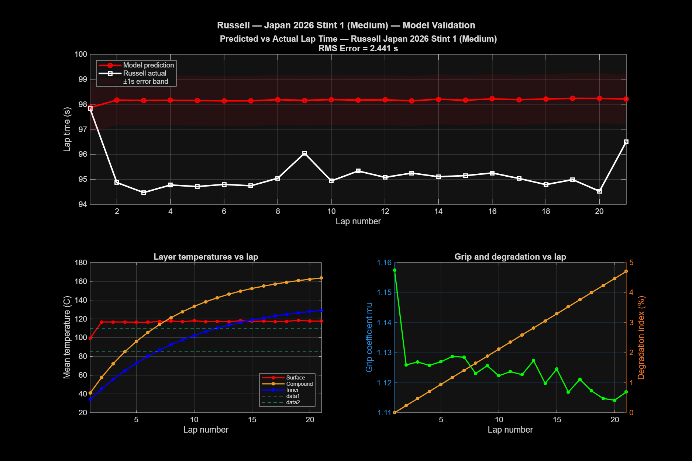

# F1 Tire Degradation Model 🏎️

A physics-based tire degradation model for Formula 1, built in MATLAB using real telemetry data from **George Russell's 2026 Japanese Grand Prix** at Suzuka. The model simulates thermal dynamics across three tire layers and predicts lap time degradation over a race stint.

---

## Overview

Tire degradation is one of the most critical and complex factors in F1 race strategy. This project models the physics of tire behaviour from first principles — heat generation, thermal diffusion, and grip loss — and validates the output against Russell's actual lap times from Japan 2026.

The model achieves an **RMS lap time error of 2.441 seconds** over a 21-lap Medium compound stint.

---

## Physics

The model is built around three core components:

**1. Heat Input Q(t)**  
Friction power at the contact patch is computed from the real speed trace and estimated lateral/longitudinal acceleration. This becomes the forcing function driving the thermal ODE.

**2. 3-Layer Thermal ODE**  
Energy balance equations are solved with `ode45` across three tire layers:
- Surface (contact patch)
- Compound (rubber bulk)
- Inner liner (carcass)

Each layer exchanges heat via convection and conduction. The surface layer gains heat from Q(t) and loses it to convection with ambient air.

**3. Grip and Lap Time Model**  
Surface temperature feeds into a bell-curve grip function — grip peaks at an optimal temperature window and falls off when the tire is too cold (green tire) or too hot (overheating). Grip loss directly translates to lap time delta via a reference lap time scaling approach.

---

## Results

| Metric | Value |
|---|---|
| Compound | Medium |
| Stint length | 21 laps |
| Lap time range (actual) | 94.47 – 97.82 s |
| RMS lap time error | **2.441 s** |

**Tuned parameters:**

| Parameter | Value |
|---|---|
| mu_max | 1.70 |
| wear_rate | 0.004 |
| corner_frac | 0.14 |
| hconv | 1200 |
| alpha | 0.08 |
| T_peak | 95 °C |
| width_low | 30 |
| width_hi | 20 |
| mu_cold | 0.90 |

### Validation Plot



---

## Project Structure

```
f1-tire-degradation-model/
├── matlab/
│   ├── main.m                  # Entry point — runs full pipeline
│   ├── load_data.m             # Loads FastF1 CSVs into MATLAB
│   ├── heat_input.m            # Computes Q(t) from speed trace
│   ├── thermal_ode.m           # 3-layer ODE definition
│   ├── run_thermal.m           # Solves ODE over a full lap
│   ├── run_thermal_lap.m       # Per-lap thermal wrapper
│   ├── grip_model.m            # Bell-curve grip function
│   ├── compute_laptime.m       # Lap time from grip
│   ├── stint_simulator.m       # Full stint loop
│   ├── tune_model.m            # Grid search parameter tuning
│   ├── run_stint_fast.m        # Fast evaluation for tuning
│   ├── plot_results.m          # Intermediate result plots
│   └── plot_validation.m       # Final 2x2 validation figure
├── python/
│   └── fetch_data.py           # FastF1 data extraction script
├── plots/
│   └── validation_russell_japan2026.png
└── README.md
```

---

## How to Run

### 1. Get the telemetry data

You need Python with FastF1 installed:

```bash
pip install fastf1 pandas
python python/fetch_data.py
```

This saves three CSVs into `data/2026_Japan_RUS/`:
- `lap_data.csv`
- `speed_trace.csv`
- `weather.csv`

### 2. Run the MATLAB model

Open MATLAB, navigate to the `matlab/` folder, and run:

```matlab
main
```

The script will:
1. Load the telemetry data
2. Compute the heat input profile
3. Run the parameter tuning grid search
4. Simulate the full 21-lap stint
5. Generate and save the validation plot to `plots/`

---

## Requirements

- MATLAB R2021a or later (uses `ode45`, `subplot`, standard toolboxes only)
- Python 3.8+ with `fastf1` and `pandas` (for data extraction only)

---

## Data

Raw telemetry CSVs are not included in this repository (too large, sourced from FastF1). Run `python/fetch_data.py` to regenerate them locally.

---

## References

- Farroni, F. et al. (2014). *TRT: Thermo Racing Tyre — A Physical Model to Predict Tyres Thermal Behaviour and Its Effects on Vehicle Performance.* SAE Technical Paper.
- FastF1 Python library — [theoehrly.github.io/Fast-F1](https://theoehrly.github.io/Fast-F1/)
